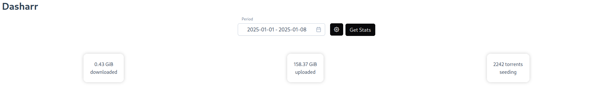

# Dasharr

 Dashboard of your indexers' usage

 

  

 > Note: this project is in very early stages, expect bugs and breaking changes !

 
 

## Why ?

We often times don't realize the evolution of the stats on torrent indexers, this fixes it. Also :

- see the impact of automated tools
- see the impact of new uploads
- have a clearer view of how much bounty can be spent on requests every n days
- because it's cool

 
 
 <b> Supported indexers </b> 

 * Aither
 * AR
 * ANT
 * BLU
 * BTN
 * GGn
 * ItaTorrents
 * LST
 * MAM
 * OPS
 * OTW
 * RED
 * seedpool

 ## Quickstart

 ### Docker

- Copy [docker-compose.yml](./docker-compose.yml), edit the fields you want (most importantly the `API_KEY` env var).
- Run the container `docker-compose up -d`
- Go to the config volume and enable the indexers you want in `config.json` (set the `enabled` field to `true`)
- Visit the webui and configure the indexers that require credentials configuration in the settings
- Restart the container, a first stats collection will be made
- New stats will be collected for the enabled indexers (in `config.json`) every 6h